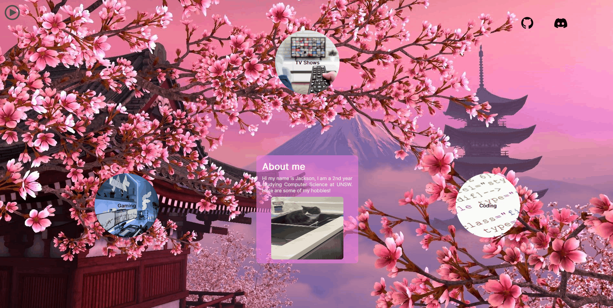

<a name="readme-top"></a>
<!-- PROJECT LOGO -->
<br />
<div align="center">
  <a href="https://github.com/jaxondinh/myWebsite">
    
  </a>

<h3 align="center">myWebsite</h3>

  <p align="center">
    A Simple Website About Me
    <br />
    <br />
    <br />
  </p>
</div>


<!-- TABLE OF CONTENTS -->
<details>
  <summary>Table of Contents</summary>
  <ol>
    <li>
      <a href="#about-the-project">About The Project</a>
      <ul>
        <li><a href="#built-with">Built With</a></li>
      </ul>
    </li>
    <li>
      <a href="#getting-started">Getting Started</a>
      <ul>
        <li><a href="#prerequisites">Prerequisites</a></li>
        <li><a href="#installation">Installation</a></li>
      </ul>
    </li>
    <li><a href="#usage">Usage</a></li>
    <li><a href="#license">License</a></li>
  </ol>
</details>


<!-- ABOUT THE PROJECT -->
## About The Project
myWebsite is a simple website made for CSESoc Trainee Program 2023, it was made after first learning HTML and CSS. The premise being "my hobbies".

### Built With
* [![HTML][HTML5]][HTML5-url]
* [![CSS][CSS-logo]][CSS-url]


<!-- GETTING STARTED -->
## Getting Started
This website is currently not deployed. To get a local copy up and running follow these simple example steps.

### Prerequisites
This project requires a web browser of your choice.

### Installation
1. Clone the repo
   ```sh
   git clone https://github.com/jaxondinh/myWebsite.git
   ```
2. Open `index.html` in your chosen web browser

<!-- USAGE EXAMPLES -->
## Usage
myWebsite is a simple display of my hobbies and some information about me at the time (2023). It has some simple hover effects as shown:

<!-- LICENSE -->
## License

Distributed under the MIT License. See `LICENSE.txt` for more information.

<p align="right">(<a href="#readme-top">back to top</a>)</p>

[HTML5]: https://img.shields.io/badge/HTML5-E34F26?logo=HTML5
[HTML5-url]: https://developer.mozilla.org/en-US/docs/Glossary/HTML5
[CSS-logo]: https://img.shields.io/badge/CSS3-1572B6?logo=CSS3
[CSS-url]: https://developer.mozilla.org/en-US/docs/Web/CSS
